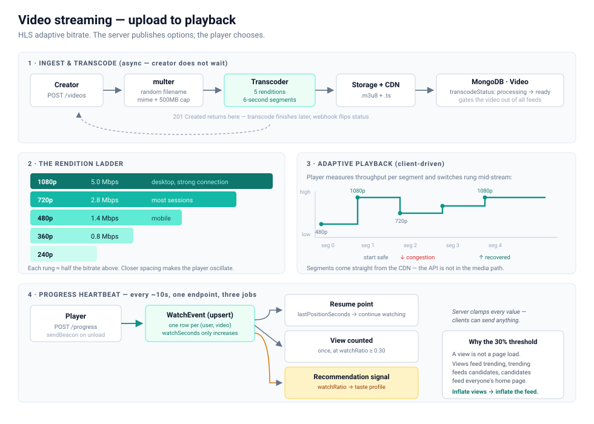
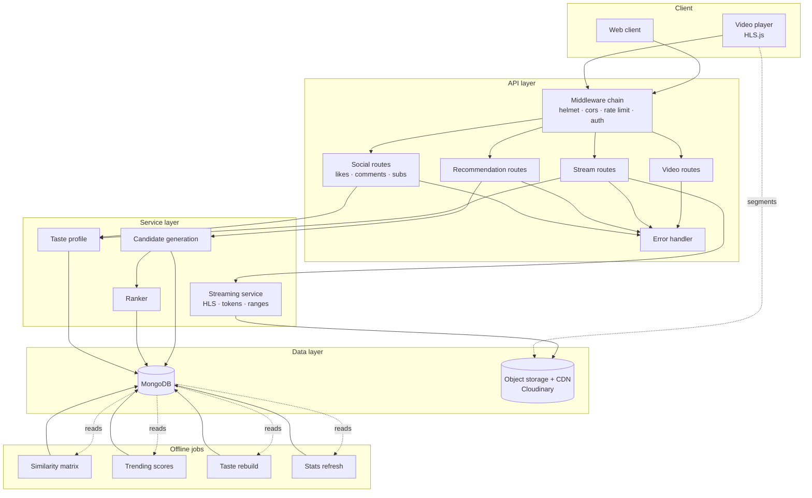
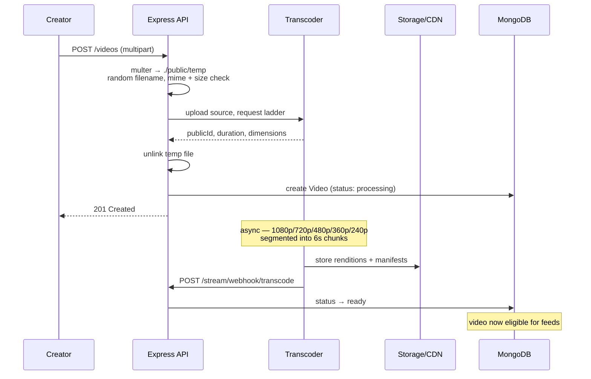
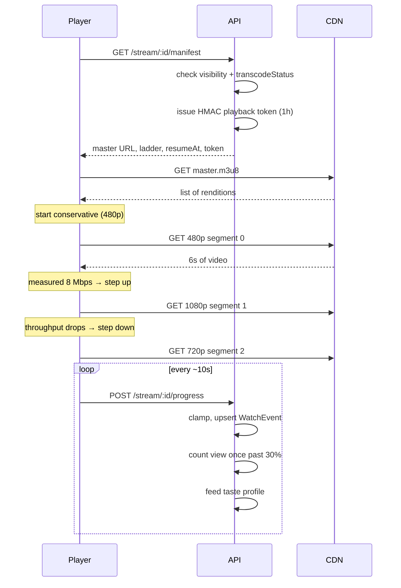
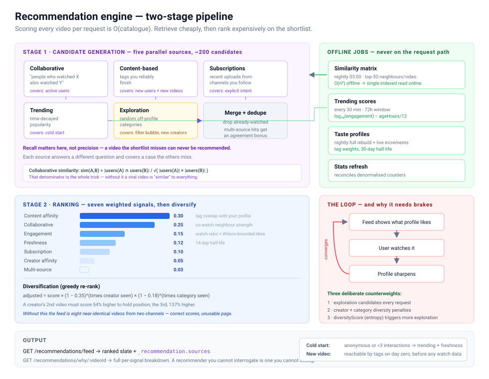
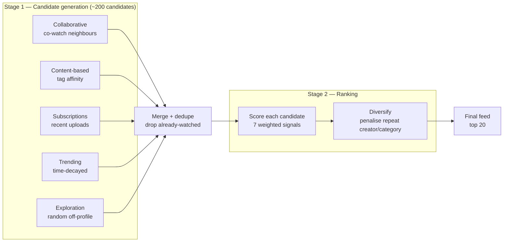
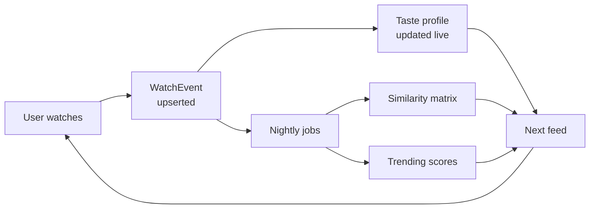
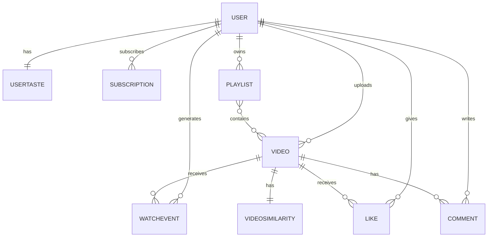

# Video Streaming Platform with Recommendation Engine

A YouTube-style platform: HLS adaptive-bitrate video delivery on a Node.js/Express/MongoDB backend, a hybrid recommendation engine (collaborative filtering + content-based filtering + popularity signals), and a Next.js frontend.

**Stack** — Node.js · Express · MongoDB (Mongoose) · JWT · Cloudinary · HLS · Next.js 15 (App Router) · TypeScript

---

## What it does

- **Adaptive streaming** — five-rung rendition ladder, 6-second HLS segments, client-side bitrate switching, signed short-lived playback tokens, byte-range fallback for non-HLS clients
- **Hybrid recommendations** — two-stage pipeline (candidate generation → ranking) drawing on five retrieval sources, with diversity re-ranking and an explainability endpoint
- **Watch tracking** — progress heartbeats, resume-where-you-left-off, threshold-based view counting that resists refresh-loop inflation
- **Social layer** — subscriptions, likes, comments, playlists, short posts
- **Creator analytics** — views, watch hours, retention, 30-day trend

---

## Architecture

The system is a **layered monolith** with a deliberate split between the **online path** (must answer in milliseconds) and the **offline path** (can take minutes). Everything expensive runs offline; the request path only ever reads precomputed results.





**Why a monolith.** At this scale the operational cost of microservices buys nothing. The seams that matter are already drawn — services never import controllers, controllers never contain business logic, and the recommendation engine talks to the rest of the system through two function calls. Splitting `services/recommendation` into its own process later is a deployment change, not a rewrite.

### Directory layout

```
Backend/src/
├── controllers/     HTTP concerns only: parse, validate, delegate, respond
├── services/
│   ├── recommendation/   candidateGeneration · ranker · tasteProfile
│   └── streaming/        hls.service
├── models/          Mongoose schemas + indexes
├── jobs/            offline batch pipeline
├── middlewares/     auth · optionalAuth · multer · rateLimit · error
├── routes/          thin route → controller wiring
└── utils/           ApiError · ApiResponse · asyncHandler · cloudinary

Frontend/src/        Next.js 15 App Router, TypeScript, Server Components
```

---

## Video streaming

### The problem

Serving one MP4 file to everyone fails at both ends. A phone on a weak connection buffers constantly; a desktop on fibre gets a needlessly soft picture. And because an MP4 is a single object, seeking means either downloading everything before the target or hoping the server supports byte ranges.

Adaptive bitrate streaming (HLS) solves both: encode the video several times at different qualities, cut each into short segments, and let the **player** decide which quality to fetch next based on how fast the last segment arrived.

### Upload and transcode



The response returns before transcoding finishes. The creator is not made to wait minutes for ffmpeg, and `transcodeStatus` keeps unfinished videos out of every feed query until they are actually playable.

### The rendition ladder

| Rung  | Height | Bitrate  | Target                     |
|-------|--------|----------|----------------------------|
| 1080p | 1080   | 5.0 Mbps | Desktop, good connection   |
| 720p  | 720    | 2.8 Mbps | Default for most sessions  |
| 480p  | 480    | 1.4 Mbps | Mobile data                |
| 360p  | 360    | 0.8 Mbps | Weak connection            |
| 240p  | 240    | 0.4 Mbps | Fallback, keeps audio alive|

Each rung is roughly half the bitrate of the one above — rungs closer together make the player oscillate between them, producing visible quality flicker without improving the experience. Renditions above the source height are never generated; upscaling costs CPU and bandwidth to produce a worse picture than the original.

### Playback



**The player adapts, not the server.** The server publishes options; the client measures its own throughput and buffer level and chooses. This is why HLS works across networks the server knows nothing about.

**Playback tokens are HMAC-signed and short-lived.** Without them any URL can be hotlinked forever. The token binds video ID, user ID and an expiry, and verification uses `crypto.timingSafeEqual` — a naive `===` comparison leaks signature bytes through timing.

**Progress is upserted, not appended.** One row per `(user, video)`, and `watchSeconds` only ever increases. A viewer scrubbing back and forth produces one honest record rather than fifty inflated ones.

### Byte-range fallback

For clients that can't play HLS, `/stream/:id/download` serves progressive MP4 with `Range` support:

```
GET /stream/abc/download
Range: bytes=1048576-

HTTP/1.1 206 Partial Content
Content-Range: bytes 1048576-3145727/52428800
Accept-Ranges: bytes
```

This is what makes seeking work without HLS — the player jumps to the middle of a 50 MB file without fetching the first megabyte. Requests are capped at 2 MB per slice so one call cannot pull a whole 4K file into memory.

### What counts as a view

A view is **not** an impression and not a page load. It is recorded once `watchRatio >= 0.30`, exactly once per `(user, video)`, guarded by the `countedAsView` flag.

This matters more than it looks. View count feeds the trending score, which feeds candidate generation, which feeds the feed. If a refresh loop could inflate views, it would inflate recommendations for everyone.

---

## Recommendation engine

### Shape of the problem

With N videos in the catalogue, scoring all of them per request is O(N) per user and does not survive contact with a real catalogue. The standard answer — and what this implements — is a **two-stage pipeline**:

1. **Candidate generation** — cheap, high recall, cuts N down to a few hundred
2. **Ranking** — expensive, high precision, orders that shortlist





### The five candidate sources

| Source | Question it answers | Covers |
|--------|--------------------|--------|
| **Collaborative** | What did similar viewers watch? | Strongest signal for active users |
| **Content-based** | What matches tags you finish? | New users, brand-new videos |
| **Subscription** | What did your channels post? | Explicit intent |
| **Trending** | What's happening now? | Cold start, cultural relevance |
| **Exploration** | What haven't you tried? | Filter-bubble escape, new creators |

A video surfaced by several sources at once carries that agreement into the ranker as a small bonus — independent retrieval paths converging is itself evidence.

### Collaborative filtering

Item-item, not user-user: the number of videos grows more slowly than the number of users, and item neighbourhoods are far more stable over time.

For each pair of videos, count users who watched both, then normalise:

```
sim(A,B) = |users(A) ∩ users(B)| / √(|users(A)| × |users(B)|)
```

That denominator is the whole trick. Without it, a viral video co-occurs with everything and is therefore "similar" to everything — popularity would swamp the similarity matrix entirely. Dividing by the geometric mean of each video's own popularity asks a better question: *given how popular both are, is this overlap surprising?*

Two guards on the input:

- users with fewer than 2 watches contribute nothing to any pair
- users with more than 300 watches are excluded as probable bots — one such account would otherwise link hundreds of unrelated videos

This is O(watches × videos-per-user²), far too slow for a request. So it runs nightly and materialises the top 50 neighbours per video into `VideoSimilarity`. The request path becomes a single indexed lookup.

### Content-based filtering

Each user gets a `UserTaste` document: a sparse map of tag → weight, learned from behaviour rather than declared.

```
weight(tag) = Σ over watches containing that tag of
                  signal(watchRatio) × 0.5^(ageDays / 30)
```

**Watch ratio dominates, not likes.** A like is one click and costs nothing. Finishing a 20-minute video is 20 minutes of revealed preference. Watches are weighted 1.0, comments 0.7, likes 0.5.

**Abandonment is a negative signal.** Starting a video and quitting inside 10% subtracts weight (−0.4). Treating that as neutral throws away the clearest "not for me" the user ever gives you.

The 30-day half-life is what lets taste *drift*. Without decay, whatever someone watched in their first week anchors their feed forever.

Matching a video to a profile is cosine similarity, with the video side binary (tag present or absent):

```
affinity = Σ weight(tag) for tags on the video
           ─────────────────────────────────────
           ‖user vector‖ × √(number of video tags)
```

### Ranking

Seven weighted signals:

| Signal | Weight | What it measures |
|--------|--------|------------------|
| Content affinity | 0.30 | Tag overlap with taste profile |
| Collaborative | 0.25 | Co-watch neighbour strength |
| Engagement | 0.15 | Avg watch ratio + Wilson-bounded like rate |
| Freshness | 0.12 | 14-day half-life decay |
| Subscription | 0.10 | Creator followed |
| Creator affinity | 0.05 | Creator finished, follow or not |
| Multi-source | 0.03 | Retrieval paths agreeing |

**Why a hand-tuned linear model.** Every number is explainable, tunable, and debuggable from one log line. `GET /recommendations/why/:videoId` returns the full per-signal breakdown. Replacing this with a learned ranker later means swapping one function — the pipeline around it is unchanged.

**Wilson lower bound on likes.** A video with 3 likes from 3 views has a 100% like rate but tells you nothing. The Wilson score interval gives the lower bound of the true rate at 95% confidence, so 900/1000 correctly outranks 3/3.

### Diversification

Pure score-ordering produces a feed of eight near-identical videos from two creators. Scores are technically correct and the feed is unusable.

A greedy re-rank (simplified MMR) walks the sorted list applying a compounding penalty each time a creator or category repeats:

```
adjusted = score × (1 − 0.35)^(times creator seen)
                 × (1 − 0.18)^(times category seen)
```

A creator's second video needs to score 54% higher than a fresh one to hold the same position; the third needs 137% higher. Relevance still wins, but only when it wins decisively.

### Cold start

| Situation | Strategy |
|-----------|----------|
| Anonymous visitor | Trending + freshness |
| < 3 interactions | Trending, weighted toward diversity |
| New video, 0 views | Content-based reaches it via tags immediately |
| New creator | Exploration source guarantees non-zero impressions |

The item-side cold start is the one people usually miss. A video uploaded ten minutes ago has no co-watch neighbours and never will unless something shows it to someone. Tags let content-based retrieval find it on day zero, and the exploration source guarantees it a floor of impressions.

### The feedback loop



This loop is also the system's main risk: it converges. The feed shows what the profile likes, the user watches it, the profile sharpens, the feed narrows.

Three deliberate counterweights:

1. **Exploration candidates** — a fixed slice of off-profile content every request
2. **Diversity penalties** — creator and category repetition is taxed
3. **`diversityScore`** — normalised Shannon entropy over the user's categories; low entropy means the bubble is tightening and more exploration is warranted

Users can also inspect their profile (`GET /recommendations/profile`) and wipe it (`DELETE`). A recommender that has drawn the wrong conclusions about someone and offers no way to correct it is a design failure, not just a UX gap.

---

## Data model



`WatchEvent` is the centre of gravity. It feeds view counts, resume points, continue-watching, trending, the similarity matrix, taste profiles, and creator analytics. Everything else is comparatively replaceable.

### Denormalisation

`views`, `likesCount`, `commentsCount` and `avgWatchRatio` are duplicated onto `Video`. Source of truth stays in `Like` / `Comment` / `WatchEvent`; the copies exist so a feed query can sort without a join. `refreshVideoStats()` reconciles them, so drift is bounded by one job interval rather than permanent.

### Indexes

| Index | Serves |
|-------|--------|
| `{title, description, tags}` text | Search, weighted title ×10 |
| `{isPublished, visibility, createdAt}` | Home feed |
| `{owner, createdAt}` | Channel pages |
| `{trendingScore}` | Trending rail |
| `{tags, createdAt}` | Content-based retrieval |
| `{user, video}` unique partial | One watch row per pair |
| `{user, watchRatio, updatedAt}` | Collaborative seeds |
| `{video, watchRatio}` | Co-watch computation |

The unique partial index on `WatchEvent {user, video}` is what makes the heartbeat upsert safe under concurrency — two simultaneous heartbeats cannot create duplicate rows.

---

## Online / offline split

| Path | Frequency | Latency budget | Work |
|------|-----------|----------------|------|
| Feed request | per page view | < 200 ms | 5 indexed reads + in-memory scoring |
| Progress heartbeat | per 10 s per viewer | < 50 ms | 1 upsert + 1 profile update |
| Trending job | every 30 min | minutes | Aggregate recent watch window |
| Similarity job | nightly | minutes | Full co-watch matrix |
| Taste rebuild | nightly | minutes | Per-user reconstruction |

The rule the codebase follows: **if it's O(catalogue) or O(users), it runs offline.** The request path only ever reads precomputed collections.

---

## Where this breaks, and what to do about it

Honest limits of the current design:

**Similarity is O(n²) in videos per user.** Fine to roughly 10k videos and 100k users. Beyond that, switch to min-hash LSH for approximate neighbours, or move to matrix factorisation with learned embeddings.

**Taste profiles are tag-based, so they inherit tag quality.** Creators mistagging videos degrades recommendations directly. Mitigations, in order of effort: a controlled vocabulary, tag suggestions from title/description, then learned embeddings that skip tags entirely.

**No A/B testing harness.** The ranker weights are reasoned, not measured. The `_recommendation.breakdown` payload and `WatchEvent.source` / `rankPosition` fields exist specifically so this can be added — you can already measure click-through and completion by feed source.

**Single MongoDB instance.** The read-heavy paths (feed, trending, similarity) are ideal candidates for read replicas or a Redis cache in front, since all three read data that is minutes-to-hours stale by design.

**Position bias is recorded but not corrected.** `rankPosition` is captured on every watch event, but nothing yet debiases for the fact that position 1 gets clicked more regardless of quality. Inverse propensity weighting is the standard fix and the data is already there.

---

## Setup

```bash
cd Backend
npm install
cp .env.sample .env      # then fill in the values
npm run dev
```

Generate the token secrets rather than inventing them:

```bash
node -e "console.log(require('crypto').randomBytes(48).toString('hex'))"
```

Required `.env` values:

```env
PORT=8000
MONGODB_URI=your_mongodb_connection_string
CORS_ORIGIN=*
ACCESS_TOKEN_SECRET=your_access_token_secret
ACCESS_TOKEN_EXPIRY=1d
REFRESH_TOKEN_SECRET=your_refresh_token_secret
REFRESH_TOKEN_EXPIRY=10d
CLOUDINARY_CLOUD_NAME=your_cloudinary_cloud_name
CLOUDINARY_API_KEY=your_cloudinary_api_key
CLOUDINARY_API_SECRET=your_cloudinary_api_secret
```

### Seeding

The recommender needs interaction data to do anything. With an empty database every request falls back to cold start.

```bash
npm run seed     # 20 users, 80 videos, realistic watch patterns
npm run jobs     # build similarity matrix + taste profiles
```

Seeded accounts: `seeduser1` … `seeduser20`, password `Password123!`

### Offline jobs

```bash
npm run jobs                  # full pipeline once
npm run jobs:schedule         # stay resident, run on cron
node src/jobs/runJobs.js similarity   # individual job
```

In production run `jobs:schedule` as a separate process — trending refreshes every 30 minutes, the similarity matrix nightly at 03:00.

### Tests

```bash
node --test tests/unit.test.mjs
```

### Frontend

```bash
cd Frontend
npm install
npm run dev      # http://localhost:3000
```

Next.js 15 (App Router) + TypeScript. Rewrites `/api` to port 8000, so the session cookie stays same-origin. The feed, watch page and Studio are Server Components that fetch with the forwarded cookie, so personalised data lands in the first paint. See [`Frontend/README.md`](Frontend/README.md).

---

## API

Base URL `/api/v1`. Auth via `Authorization: Bearer <token>` or the `accessToken` cookie.

### Users
| Method | Path | Auth |
|---|---|---|
| POST | `/users/register` | — |
| POST | `/users/login` | — |
| POST | `/users/logout` | ✓ |
| POST | `/users/refresh-token` | — |
| POST | `/users/change-password` | ✓ |
| GET | `/users/current-user` | ✓ |
| PATCH | `/users/update-account` | ✓ |
| PATCH | `/users/avatar` · `/users/cover-image` | ✓ |
| GET | `/users/c/:username` | ✓ |
| GET | `/users/history` | ✓ |

### Videos
| Method | Path | Auth |
|---|---|---|
| GET | `/videos` | optional |
| POST | `/videos` | ✓ |
| GET | `/videos/:videoId` | optional |
| PATCH · DELETE | `/videos/:videoId` | ✓ owner |
| PATCH | `/videos/toggle/publish/:videoId` | ✓ owner |

`GET /videos` accepts `page`, `limit`, `query`, `sortBy`, `sortType`, `userId`.

### Streaming
| Method | Path | Auth |
|---|---|---|
| GET | `/stream/:videoId/manifest` | optional |
| GET | `/stream/:videoId/master.m3u8` | optional + token |
| GET | `/stream/:videoId/download` | optional + token |
| POST | `/stream/:videoId/progress` | optional |
| GET | `/stream/continue-watching` | ✓ |
| POST | `/stream/webhook/transcode` | provider |

### Recommendations
| Method | Path | Auth |
|---|---|---|
| GET | `/recommendations/feed` | optional |
| GET | `/recommendations/related/:videoId` | optional |
| GET | `/recommendations/trending` | optional |
| GET | `/recommendations/why/:videoId` | ✓ |
| GET · DELETE | `/recommendations/profile` | ✓ |
| POST | `/recommendations/rebuild` | ✓ |

`?explain=true` on `/feed` returns per-signal score breakdowns.

### Social
| Method | Path | Auth |
|---|---|---|
| GET · POST | `/comments/:videoId` | optional · ✓ |
| PATCH · DELETE | `/comments/c/:commentId` | ✓ |
| POST | `/likes/toggle/v/:videoId` · `/c/:commentId` · `/t/:tweetId` | ✓ |
| GET | `/likes/videos` | ✓ |
| POST | `/subscriptions/toggle/:channelId` | ✓ |
| GET | `/subscriptions/c/:subscriberId` | optional |
| GET | `/subscriptions/u/:channelId` | optional |
| POST · GET · PATCH · DELETE | `/playlist/...` | ✓ |
| GET | `/dashboard/stats` · `/dashboard/videos` | ✓ |

---

## Player integration

```js
import Hls from "hls.js";

const { data } = await fetch(`/api/v1/stream/${videoId}/manifest`, {
  credentials: "include",
}).then(r => r.json());

const hls = new Hls();
hls.loadSource(data.masterPlaylistUrl);
hls.attachMedia(videoEl);

videoEl.currentTime = data.resumeAt;   // resume where they left off

// Heartbeat — drives views, resume points, and the recommender.
let watched = 0, last = 0;
videoEl.addEventListener("timeupdate", () => {
  if (videoEl.currentTime > last) watched += videoEl.currentTime - last;
  last = videoEl.currentTime;
});

setInterval(() => {
  navigator.sendBeacon(`/api/v1/stream/${videoId}/progress`,
    new Blob([JSON.stringify({
      positionSeconds: videoEl.currentTime,
      watchedSeconds: watched,
      source: "home",
    })], { type: "application/json" }));
}, 10000);
```

---

## Contributing

This project is under active development. Contributions, issues, and feature requests are welcome.

1. Fork the project
2. Create your feature branch (`git checkout -b feature/AmazingFeature`)
3. Commit your changes (`git commit -m 'Add some AmazingFeature'`)
4. Push to the branch (`git push origin feature/AmazingFeature`)
5. Open a Pull Request

---